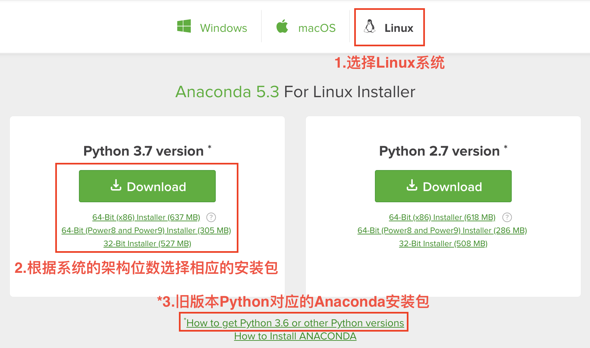

# Content

1. [通过 Anaconda 安装 TensorFlow](https://github.com/jaydu1/TensorFlow-Tutorial/tree/master/02%20Installation%20of%20TensorFlow%20on%20Linux#1-%E9%80%9A%E8%BF%87-anaconda-%E5%AE%89%E8%A3%85-tensorflow)
    1. [安装 Anaconda](https://github.com/jaydu1/TensorFlow-Tutorial/tree/master/02%20Installation%20of%20TensorFlow%20on%20Linux#11%E5%AE%89%E8%A3%85-anaconda)
    2. [创建虚拟环境（可选）](https://github.com/jaydu1/TensorFlow-Tutorial/tree/master/02%20Installation%20of%20TensorFlow%20on%20Linux#12%E5%88%9B%E5%BB%BA%E8%99%9A%E6%8B%9F%E7%8E%AF%E5%A2%83%E5%8F%AF%E9%80%89)
    3. [安装 CPU 版 TensorFlow](https://github.com/jaydu1/TensorFlow-Tutorial/tree/master/02%20Installation%20of%20TensorFlow%20on%20Linux#13%E5%AE%89%E8%A3%85-cpu-%E7%89%88-tensorflow)
    4. [安装 GPU 版 TensorFlow](https://github.com/jaydu1/TensorFlow-Tutorial/tree/master/02%20Installation%20of%20TensorFlow%20on%20Linux#14%E5%AE%89%E8%A3%85-gpu-%E7%89%88-tensorflow)
    5. [便捷安装方法](https://github.com/jaydu1/TensorFlow-Tutorial/tree/master/02%20Installation%20of%20TensorFlow%20on%20Linux#15%E4%BE%BF%E6%8D%B7%E5%AE%89%E8%A3%85%E6%96%B9%E6%B3%95)
2. [通过 pip 安装 TensorFlow](https://github.com/jaydu1/TensorFlow-Tutorial/tree/master/02%20Installation%20of%20TensorFlow%20on%20Linux#2%E9%80%9A%E8%BF%87-pip-%E5%AE%89%E8%A3%85-tensorflow)
    1. [安装 Python 开发环境](https://github.com/jaydu1/TensorFlow-Tutorial/tree/master/02%20Installation%20of%20TensorFlow%20on%20Linux#21%E5%AE%89%E8%A3%85-python-%E5%BC%80%E5%8F%91%E7%8E%AF%E5%A2%83)
    2. [创建虚拟环境（可选）](https://github.com/jaydu1/TensorFlow-Tutorial/tree/master/02%20Installation%20of%20TensorFlow%20on%20Linux#22%E5%88%9B%E5%BB%BA%E8%99%9A%E6%8B%9F%E7%8E%AF%E5%A2%83%E5%8F%AF%E9%80%89)
    3. [安装 CPU 版 TensorFlow](https://github.com/jaydu1/TensorFlow-Tutorial/tree/master/02%20Installation%20of%20TensorFlow%20on%20Linux#23%E5%AE%89%E8%A3%85-cpu-%E7%89%88-tensorflow)
    4. [安装 GPU 版 TensorFlow](https://github.com/jaydu1/TensorFlow-Tutorial/tree/master/02%20Installation%20of%20TensorFlow%20on%20Linux#24%E5%AE%89%E8%A3%85-gpu-%E7%89%88-tensorflow)
        1. [安装 CUDA](https://github.com/jaydu1/TensorFlow-Tutorial/tree/master/02%20Installation%20of%20TensorFlow%20on%20Linux#241%E5%AE%89%E8%A3%85-cuda)
        2. [安装 cuDNN](https://github.com/jaydu1/TensorFlow-Tutorial/tree/master/02%20Installation%20of%20TensorFlow%20on%20Linux#242%E5%AE%89%E8%A3%85-cudnn)
        3. [安装 GPU 版 TensorFlow](https://github.com/jaydu1/TensorFlow-Tutorial/tree/master/02%20Installation%20of%20TensorFlow%20on%20Linux#243%E5%AE%89%E8%A3%85-gpu-%E7%89%88-tensorflow)

# 1. 通过 Anaconda 安装 TensorFlow
## 1.1	安装 Anaconda
Anaconda 是⼀个开源的 Python 发⾏版本，它预安装了多个常⽤ Python 包，同时也提供了 Python 环境的管理⼯具。如果需要节省磁盘空间，也可安装 Mniconda 这个较⼩的发⾏版，⾃⾏安装所需要的包。 通过 Anaconda 安装 TensorFlow ⽐较简单，并且它对 CPU 计算进⾏了优化，计算速度优于通过 pip ⽅式 安装的 TensorFlow[[1]](https://www.anaconda.com/blog/developer-blog/tensorflow-in-anaconda/)，建议初学者采⽤这种⽅式。

读者需要根据系统位数下载相应版本的 Anaconda 安装包。笔者的操作平台是 Ubuntu 16.04 的 64 位 系统虚拟机，在书写本书时 Anaconda 对应的最新版本是 5.3，可能与读者阅读时的最新版本不同，读者只需安装最新版本即可。Python 也有两个版本可选，分别是 Python 2.x 和 Python 3.x，建议安装 Python 3.x 版本。

读者可以按快捷键 Ctrl+Atl+T 打开 Terminal，并在 Terminal 内输⼊以下代码，确定⾃⼰系统的位数是否为 32 位或者 64 位：

    >>> getconf LONG_BIT

下载安装包有两种⽅式：

（⼀）读者若使⽤⾮图形化界⾯系统，可以直接运⾏以下指令来获取指定版本的 Anaconda 安装包：

    >>>  wget https://repo.anaconda.com/archive/Anaconda3-5.3.0-Linux-x86_64.sh

  （⼆）读者若使⽤图形化界⾯系统，也可以登录 Anaconda 官⽹下载页⾯[[2]](https://www.anaconda.com/download/#linux)下载系统对应的 Linux 安装 包。在⽹页上找到如图 2-1所在位置：

如果上述官⽅⽹址下载速度较慢，也可选择国内的清华⼤学镜像地址[[3]](https://mirrors.tuna.tsinghua.edu.cn/anaconda/archive/)。

下载⾄本地后，进⼊⽂件 Anaconda3-5.3.0-Linux-x86_64.sh 所在⽬录，并运⾏该⽂件，按照提⽰进⾏安装：

    >>> bash Anaconda3-5.3.0-Linux-x86_64.sh
    Welcome to Anaconda3 5.3.0 In order to continue the installation process, please review the license agreement. Please, ENTER to continue
    >>> # 回车
    ===================================
    Anaconda End User License Agreement
    ===================================
    •••（此处忽略了条款内容）•••
    Do you accept the license terms? [yes|no]
    [no] >>> yes
    Anaconda3 will now be installed into this location: /home/parallels/anaconda3
    - Press ENTER to confirm the location
    - Press CTRL-C to abort the installation
    - Or specify a different location below
    [/home/parallels/anaconda3] >>> # 回车使用默认安装路径或输入指定其它安装路径
    •••（此处忽略了部分输出信息）•••
    installation finished.
    Do you wish the installer to initialize Anaconda3 in your /home/parallels/.bashrc ? [yes|no]
    [no] >>> yes  # 添加到环境变量。默认选择 no，如果选择 no，可以在安装完成后修改 ~/.bashrc 文件， 将 Anaconda 的安装路径添加到文件最后： export PATH=anaconda3/bin:$PATH，保存后重新加载该文件： source ~/.bashrc
    Initializing Anaconda3 in /home/parallels/.bashrc A backup will be made to: /home/parallels/.bashrc-anaconda3.bak For this change to become active, you have to open a new terminal.
    Thank you for installing Anaconda3!
    ===========================================================================
    Anaconda is partnered with Microsoft! Microsoft VSCode is a streamlined code editor with support for development operations like debugging, task running and version control.
    To install Visual Studio Code, you will need:
    - Administrator Privileges
    - Internet connectivity
    Visual Studio Code License: https://code.visualstudio.com/license
    Do you wish to proceed with the installation of Microsoft VSCode? [yes|no]
    >>> yes # （可选）安装 VSCode
    Proceeding with installation of Microsoft VSCode Checking Internet connectivity ... Installing Visual Studio Code ...
    [sudo] password for parallels: # 输入密码
    OK
    •••（此处忽略了部分输出信息）•••
    VSCode successfully installed in /usr/share/code !

⾄此，Anaconda 就安装成功了，关闭当前 Terminal 再重新打开后，输⼊以下指令就能看到已安装的 Anaconda 基本信息。

    >>> conda info

## 1.2	创建虚拟环境（可选）

安装 Anaconda 后，系统的默认 Python 环境会被替换为 Anaconda 中的 Python 环境，我们也可以 在 Anaconda 中创建其它虚拟环境，⽅便进⾏不同的任务，同时也不会对系统环境或者其它虚拟环境造成影 响。因此，推荐读者进⾏这⼀步创建⼀个虚拟环境，当然读者也可跳过该步，直接在 Anaconda 的 Python 环境下安装 TensorFlow。

    >>> conda create -n tf python # 创建一个名为 tf 的 Python 虚拟环境，也可以指定 Python 的版本 conda create -n tf python=3.7
    Solving environment: done
    ## Package Plan ##
    environment location: /home/parallels/anaconda3/envs/tf
    added / updated specs:
    - python
    The following packages will be downloaded:
    package          |       build
    ---------------------------|-----------------
    sqlite-3.25.2       | h7b6447c_0   1.9 MB
    •••（此处省略了部分输出信息）•••
    ------------------------------------------------------------
    Total: 2.4 MB
    The following NEW packages will be INSTALLED:
    ca-certificates: 2018.03.07-0
    •••（此处省略了部分输出信息）•••

    Proceed ([y]/n)? y
    Downloading and Extracting Packages
    sqlite-3.25.2 | 1.9 MB | ##################################### | 100%
    •••（此处省略了部分输出信息）•••
    Preparing transaction: done
    Verifying transaction: done
    Executing transaction: done
    #
    # To activate this environment, use
    #
    # 	$ conda activate tf
    #
    # To deactivate an active environment, use
    #
    # 	$ conda deactivate

安装完成后，Terminal 内也给出了激活和关闭⼀个虚拟环境的⽅法：`conda activate tf` 和 `conda deactivate`。我们输⼊以下语句进⼊ tf 环境，进⾏下⼀步：

    >>> conda activate tf

## 1.3	安装 CPU 版 TensorFlow
进⼊ tf 环境后，运⾏以下指令安装 CPU 版的 TensorFlow。如果读者没有创建虚拟环境，也可以输⼊ 同样指令进⾏安装。

    (tf) >>> conda install tensorflow # 也可指定版本号 conda install tensorflow=1.11
    Solving environment: done
    ## Package Plan ##
    environment location: /home/parallels/anaconda3/envs/tf
    added / updated specs: - tensorflow
    •••（此处省略了部分输出信息）•••
    Proceed ([y]/n)? y
    Downloading and Extracting Packages
    _tflow_select-2.3.0 | 2 KB | ##################################### | 100%
    •••（此处省略了部分输出信息）•••
    Preparing transaction: done

成功安装后运⾏以下语句，验证 TensorFlow 是否正常安装：

    >>> python -c "import tensorflow as tf; print(tf.__version__)"
    1.11.0 # 输出 TensorFlow 版本

## 1.4	安装 GPU 版 TensorFlow
使⽤ conda 指令安装了 CPU 版的 TensorFlow 之后，如果读者使⽤的电脑配置了可⽤于深度学习计算 的 NVIDIA GPU（计算能⼒⼤于等于 3.5，具体请根据电脑 GPU 版本号在 NVIDIA 官⽹进⾏查询[[4]](https://developer.nvidia.com/cuda-gpus)），则 可以安装 GPU 版本的 TensorFlow。使⽤ Anaconda 安装 GPU 版 TensorFlow 较为⽅便，它能够⾃动安 装相应的 NVIDIA 软件。

    (tf) >>> conda install tensorflow-gpu # 也可指定版本号 conda install tensorflow-gpu=1.11
    Solving environment: done
    ## Package Plan ##
    environment location: /home/parallels/anaconda3/envs/tf
    added / updated specs: - tensorflow
    •••（此处省略了部分输出信息）•••
    Proceed ([y]/n)? y
    Downloading and Extracting Packages
    _tflow_select-2.3.0 | 2 KB | ##################################### | 100%
    •••（此处省略了部分输出信息）•••
    Preparing transaction: done
    Verifying transaction: done
    Executing transaction: done

成功安装后运⾏以下语句，验证 TensorFlow 是否能正常调⽤ GPU：

    (tf) >>> python -c "import tensorflow as tf; sess = tf.Session(config=tf.ConfigProto(log_ device_placement=True));" # 输出 GPU 使用情况
    2018-10-12 14:18:12.057230: I tensorflow/core/platform/cpu_feature_guard.cc:141] Your CPU supports instructions that this TensorFlow binary was not compiled to use: AVX2 FMA
    2018-10-12 14:18:12.165572: I tensorflow/stream_executor/cuda/cuda_gpu_executor.cc:964] successful NUMA node read from SysFS had negative value (-1), but there must be at least one NUMA node, so returning NUMA node zero
    2018-10-12 14:18:12.166078: I tensorflow/core/common_runtime/gpu/gpu_device.cc:1411] Found device 0 with properties: name: Tesla P100-PCIE-16GB major: 6 minor: 0 memoryClockRate(GHz): 1.3285
    pciBusID: 0000:00:04.0
    totalMemory: 15.90GiB
    freeMemory: 15.55GiB
    2018-10-12 14:18:12.166095: I tensorflow/core/common_runtime/gpu/gpu_device.cc:1490] Adding visible gpu devices: 0
    2018-10-12 14:18:12.349196: I tensorflow/core/common_runtime/gpu/gpu_device.cc:971] Device interconnect StreamExecutor with strength 1 edge matrix:
    2018-10-12 14:18:12.349245: I tensorflow/core/common_runtime/gpu/gpu_device.cc:977] 0
    2018-10-12 14:18:12.349269: I tensorflow/core/common_runtime/gpu/gpu_device.cc:990] 0: N
    2018-10-12 14:18:12.349392: I tensorflow/core/common_runtime/gpu/gpu_device.cc:1103] Created TensorFlow device (/job:localhost/replica:0/task:0/device:GPU:0 with 15066 MB memory) -> physical GPU (device: 0, name: Tesla P100-PCIE-16GB, pci bus id: 0000:00:04.0, compute capability: 6.0)
    Device mapping: /job:localhost/replica:0/task:0/device:GPU:0 -> device: 0, name: Tesla P100-PCIE-16GB, pci bus id: 0000:00:04.0, compute capability: 6.0
    2018-10-12 14:18:12.433099: I tensorflow/core/common_runtime/direct_session.cc:291] Device mapping: /job:localhost/replica:0/task:0/device:GPU:0 -> device: 0, name: Tesla P100-PCIE-16GB, pci bus id: 0000:00:04.0, compute capability: 6.0

若⽆法正常调⽤，则有可能是系统已安装过 CUDA ⼯具，CUDA、cuDNN 与 TensorFlow 三者的 版本不对应，需要卸载后重新安装对应的版本。

## 1.5	便捷安装方法
在前⽂，我们创建了虚拟环境并安装了 CPU 或 GPU 版本 TensorFlow，但是也可以⽤⼀条指令同时实 现这两步：

    # 创建虚拟环境并安装对应版本的 TensorFlow
    # 安装 CPU 版 TensorFlow
    >>> conda create -n tf tensorflow
    # 直接安装 GPU 版 TensorFlow
    >>> conda create -n tf tensorflow-gpu

安装后激活虚拟环境：

    >>> conda activate tf

# 2.	通过 pip 安装 TensorFlow
## 2.1	安装 Python 开发环境
我们可以通过在 Terminal 内输⼊以下指令安装 Python 开发环境, 其中 pip 是⼀个现代的，通⽤的 Python 包管理⼯具。提供了对 Python 包的查找、下载、安装、卸载的功能；virtualenv 包可以⽤于创建 独⽴的 Python 运⾏环境。

    >>> sudo apt update
    [sudo] password for parallels: # 输入密码
    Hit:1 https://packages.microsoft.com/repos/vscode stable InRelease
    •••（此处省略了部分输出信息）•••
    Reading package lists... Done
    Building dependency tree
    Reading state information... Done
    461 packages can be upgraded. Run 'apt list --upgradable' to see them.
    >>> sudo apt install python3-dev python3-pip
    Reading package lists... Done
    Building dependency tree
    Reading state information... Done
    The following additional packages will be installed:
    •••（此处省略了部分输出信息）•••
    5 upgraded, 9 newly installed, 0 to remove and 456 not upgraded.
    Need to get 44.9 MB/45.0 MB of archives.
    After this operation, 57.3 MB of additional disk space will be used.
    Do you want to continue? [Y/n] y
    •••（此处省略了部分输出信息）•••
    Processing triggers for libc-bin (2.23-0ubuntu9) ...
    >>> sudo pip3 install -U virtualenv
    Collecting virtualenv
    Downloading https://files.pythonhosted.org/packages/b6/30/96a02b2287098b23b875bc8c2f58071 c35d2efe84f747b64d523721dc2b5/virtualenv-16.0.0-py2.py3-none-any.whl (1.9MB) 100% || 1.9MB 880kB/s
    Installing collected packages: virtualenv
    Successfully installed virtualenv-16.0.0

安装完成后，通过以下指令检验环境是否配置完成：

    >>> python3 --version
    Python 3.5.2
    >>> pip3 --version
    pip 8.1.1 from /usr/lib/python3/dist-packages (python 3.5)
    >>> virtualenv --version
    16.0.0

## 2.2	创建虚拟环境（可选）
同样地，我们建议创建虚拟环境，以免对系统环境造成影响：

    >>> virtualenv --system-site-packages -p python3 ./venv # 指定虚拟环境的目录 ./venv
    Already using interpreter /usr/bin/python3
    Using base prefix '/usr'
    New python executable in /home/parallels/venv/bin/python3
    Also creating executable in /home/parallels/venv/bin/python
    Installing setuptools, pip, wheel...done.
    >>> source ./venv/bin/activate # 也可用 sh，bash，ksh 或 zsh 指令，激活虚拟环境，在虚拟环境下，安装包不会影响系统原环境
    (venv) >>> pip install --upgrade pip
    (venv) >>> pip list # show packages installed within the virtual environment

pip 的简单⽤法如下：

    # 在虚拟环境下，安装包不会影响系统原环境
    (venv) >>> pip install --upgrade pip # 升级包
    (venv) >>> pip list # 输出当前环境下已安装的包

若需要退出虚拟环境，则输⼊以下指令：

    (venv) >>> deactivate

## 2.3	安装 CPU 版 TensorFlow
如果读者已经创建了虚拟环境，则可⽤以下指令安装 CPU 版 TensorFlow：

    (venv) >>> pip install --upgrade tensorflow

如果读者未创建虚拟环境，则⽤以下指令在系统默认环境下安装：

    (venv) >>> pip3 install --user --upgrade tensorflow

安装完成后，同样测试是否正常安装：

    # 如果安装在虚拟环境中
    (venv) >>> python -c "import tensorflow as tf; print(tf.__version__)"
    1.11.0
    # 如果安装在系统环境中
    >>> python3 -c "import tensorflow as tf; print(tf.__version__)"
    1.11.0

## 2.4	安装 GPU 版 TensorFlow
### 2.4.1	安装 CUDA

（一）安装 NVIDIA 库：使⽤ pip 安装 GPU 版 TensorFlow 需要先安装 NVIDIA 相关软件。⾸先依 次输⼊以下指令下载 NVIDIA Repository：

    >>> sudo apt-key adv --fetch-keys http://developer.download.nvidia.com/compute/cuda/repos/ ubuntu1604/x86_64/7fa2af80.pub
    [sudo] password for parallels: # 输入密码
    Executing: /tmp/tmp.axQP4U1aV8/gpg.1.sh --fetch-keys http://developer.download.nvidia.com/compute/cuda/repos/ubuntu1604/x86_64/7fa2af80.pub
    gpg: key 7FA2AF80: public key "cudatools " imported
    gpg: Total number processed: 1
    gpg: imported: 1 (RSA: 1)
    >>> wget http://developer.download.nvidia.com/compute/cuda/repos/ubuntu1604/x86_64/ cuda-repo-ubuntu1604_9.1.85-1_amd64.deb
    --2018-10-12 13:20:06-- http://developer.download.nvidia.com/compute/cuda/repos/ubuntu1604 /x86_64/cuda-repo-ubuntu1604_9.1.85-1_amd64.deb
    Resolving developer.download.nvidia.com (developer.download.nvidia.com)... 60.222.11.61, 60.222.11.10, 60.222.11.11
    Connecting to developer.download.nvidia.com (developer.download.nvidia.com)|60.222.11.61| :80... connected.
    HTTP request sent, awaiting response... 200 OK Length: 2820 (2.8K) [application/x-deb]
    Saving to: ‘cuda-repo-ubuntu1604_9.1.85-1_amd64.deb’
    cuda-repo-ubuntu16 100%[================>] 2.75K --.-KB/s in 0s
    2018-10-12 13:20:06 (107 MB/s) – ‘cuda-repo-ubuntu1604_9.1.85-1_amd64.deb’ saved [2820/2820]
    >>> sudo apt install ./cuda-repo-ubuntu1604_9.1.85-1_amd64.deb
    Reading package lists... Done
    Building dependency tree
    Reading state information... Done
    Note, selecting 'cuda-repo-ubuntu1604' instead of './cuda-repo-ubuntu1604_9.1.85-1_amd64.deb'
    The following NEW packages will be installed:
    cuda-repo-ubuntu1604
    0 upgraded, 1 newly installed, 0 to remove and 456 not upgraded.
    Need to get 0 B/2,820 B of archives.
    After this operation, 37.9 kB of additional disk space will be used.
    Get:1 /home/parallels/cuda-repo-ubuntu1604_9.1.85-1_amd64.deb cuda-repo-ubuntu1604 amd64 9.1.85-1 [2,820 B]
    Selecting previously unselected package cuda-repo-ubuntu1604.
    (Reading database ... 177458 files and directories currently installed.)
    Preparing to unpack .../cuda-repo-ubuntu1604_9.1.85-1_amd64.deb ...
    Unpacking cuda-repo-ubuntu1604 (9.1.85-1) ... Setting up cuda-repo-ubuntu1604 (9.1.85-1) ...
    >>> wget http://developer.download.nvidia.com/compute/machine-learning/repos/ubuntu1604/ x86_64/nvidia-machine-learning-repo-ubuntu1604_1.0.0-1_amd64.deb
    --2018-10-12 13:20:23-- http://developer.download.nvidia.com/compute/machine-learning/ repos/ubuntu1604/x86_64/nvidia-machine-learning-repo-ubuntu1604_1.0.0-1_amd64.deb
    Resolving developer.download.nvidia.com (developer.download.nvidia.com)... 60.222.11.10, 60.222.11.11, 60.222.11.61
    Connecting to developer.download.nvidia.com (developer.download.nvidia.com)|60.222.11.10| :80... connected.
    HTTP request sent, awaiting response... 200 OK
    Length: 2816 (2.8K) [application/x-deb]
    Saving to: ‘nvidia-machine-learning-repo-ubuntu1604_1.0.0-1_amd64.deb’
    nvidia-machine-lea 100%[================>] 2.75K --.-KB/s in 0s 2018-10-12 13:20:23 (254 MB/s) – ‘nvidia-machine-learning-repo-ubuntu1604_1.0.0-1_amd64. deb’ saved [2816/2816]
    >>> sudo apt install ./nvidia-machine-learning-repo-ubuntu1604_1.0.0-1_amd64.deb
    Reading package lists... Done
    Building dependency tree
    Reading state information... Done
    Note, selecting 'nvidia-machine-learning-repo-ubuntu1604' instead of './nvidia-machine-learning-repo-ubuntu1604_1.0.0-1_amd64.deb'
    The following NEW packages will be installed:
    nvidia-machine-learning-repo-ubuntu1604
    0 upgraded, 1 newly installed, 0 to remove and 456 not upgraded. Need to get 0 B/2,816 B of archives.
    After this operation, 37.9 kB of additional disk space will be used.
    Get:1 /home/parallels/nvidia-machine-learning-repo-ubuntu1604_1.0.0-1_amd64.deb
    nvidia-machine-learning-repo-ubuntu1604 amd64 1.0.0-1 [2,816 B]
    Selecting previously unselected package nvidia-machine-learning-repo-ubuntu1604.
    (Reading database ... 177461 files and directories currently installed.)
    Preparing to unpack .../nvidia-machine-learning-repo-ubuntu1604_1.0.0-1_amd64.deb ...
    Unpacking nvidia-machine-learning-repo-ubuntu1604 (1.0.0-1) ...
    Setting up nvidia-machine-learning-repo-ubuntu1604 (1.0.0-1) ... OK
    >>> sudo apt update # 更新所有包
    •••（此处省略了输出信息）•••

（⼆）安装 CUDA 等⼯具：安装 CUDA ⼯具，本书书写时 TensorFlow 对应的 CUDA 版本为 9.0。 整个安装过程将持续⼤约 10 分钟。

    >>> sudo apt install cuda9.0
    Reading package lists... Done
    Building dependency tree
    Reading state information... Done
    •••（此处省略了部分输出信息）•••
    Do you want to continue? [Y/n] y
    •••（此处省略了部分输出信息）•••
    Processing triggers for libc-bin (2.23-0ubuntu9) ...
    Setting up cuda-license-9-0 (9.0.176-1) ...
    *** LICENSE AGREEMENT ***
    By using this software you agree to fully comply with the terms and conditions of the EULA (End User License Agreement). The EULA is located at /usr/local/cuda-9.0/doc/EULA.txt. The EULA can also be found at http://docs.nvidia.com/cuda/eula/index.html. If you do not agree to the terms and conditions of the EULA, do not use the software.
    •••（此处省略了部分输出信息）•••
    Processing triggers for initramfs-tools (0.122ubuntu8.13) ... update-initramfs: Generating /boot/initrd.img-4.15.0-1021-gcp W: mdadm: /etc/mdadm/mdadm.conf defines no arrays.
    Processing triggers for ca-certificates (20170717~16.04.1) ...
    Updating certificates in /etc/ssl/certs... 0 added, 0 removed; done.
    Running hooks in /etc/ca-certificates/update.d...
    done.
    done.

（三）添加环境变量：在 Terminal 中输⼊以下指令，输⼊以下指令修改系统配置⽂件：

    >>> echo 'export CUDA_HOME=/usr/local/cuda-9.0' >> ~/.bashrc # 读者应改为自己的 CUDA 安装路径
    >>> echo 'export PATH=$PATH:$CUDA_HOME/bin' >> ~/.bashrc
    >>> echo 'export LD_LIBRARY_PATH=$CUDA_HOME/lib64' >> ~/.bashrc
    >>> source ~/.bashrc

添加环境变量之后，我们可以通过以下指令来检验 CUDA 是否安装成功：

    >>> nvidia-smi
    Fri Oct 12 16:05:34 2018
    +-----------------------------------------------------------------------------+
    | NVIDIA-SMI 410.48 					Driver Version: 410.48 |
    |-------------------------------+----------------------+----------------------+
    | GPU Name Persistence-M			   | Bus-Id Disp.A 	  | Volatile Uncorr. ECC 		  |
    | Fan Temp Perf Pwr:Usage/Cap| Memory-Usage | GPU-Util Compute M. | |===============================+======================+======================|
    | 0 Tesla P100-PCIE... Off 			   | 00000000:00:04.0 Off | 0 						|
    | N/A 36C P0 26W / 250W 			   | 0MiB / 16280MiB 	  | 0% Default 				|
    +-------------------------------+----------------------+----------------------+
    +-----------------------------------------------------------------------------+
    | Processes: 															   GPU Memory |
    | GPU PID Type Process name Usage | |=============================================================================|
    | No running processes found |
    +-----------------------------------------------------------------------------+

（四）安装 TensorRT ⼯具（可选）：安装 CUDA ⼯具后，我们可以选择安装 TensorRT ⼯具，⽤来 加速推理（Inference）。

    >>> sudo apt update # 更新所有包
    •••（此处忽略了输出信息）•••
    >>> sudo apt install libnvinfer4=4.1.2-1+cuda9.0
    Reading package lists... Done
    Building dependency tree
    Reading state information... Done
    The following NEW packages will be installed: libnvinfer4
    0 upgraded, 1 newly installed, 0 to remove and 459 not upgraded.
    Need to get 0 B/36.1 MB of archives.
    After this operation, 104 MB of additional disk space will be used.
    Get:1 file:/var/nvinfer-runtime-trt-repo-4.0.1-ga-cuda9.0 libnvinfer4 4.1.2-1+cuda9.0 [36.1 MB]
    Selecting previously unselected package libnvinfer4.
    (Reading database ... 178769 files and directories currently installed.)
    Preparing to unpack .../libnvinfer4_4.1.2-1+cuda9.0_amd64.deb ...
    Unpacking libnvinfer4 (4.1.2-1+cuda9.0) ...
    Processing triggers for libc-bin (2.23-0ubuntu9) ...
    Setting up libnvinfer4 (4.1.2-1+cuda9.0) ...
    Processing triggers for libc-bin (2.23-0ubuntu9) ...

### 2.4.2	安装 cuDNN
下载 cuDNN 必须注册⼀个免费的 NVIDIA 账号，读者应根据 Tensorflow 的版本以及电脑系统选择 相应的 cuDNN 版本进⾏下载[[5]](https://developer.nvidia.com/cudnn)。
下载完成后⾸先解压⽂件：

      >>> tar -xvf cudnn-9.0-linux-x64-v7.1.tgz # 读者应根据自己保存的路径和文件名进行解压

解压完成后在⽬录下会有⼀个名为 cuda 的⽂件夹，将该⽂件夹内的⽂件复制到 CUDA 安装⽬录下，

    >>> sudo cp cuda/include/cudnn.h /usr/local/cuda-9.0/include/
    >>> sudo cp cuda/lib64/* /usr/local/cuda-9.0/lib64/

⾄此，cuDNN 就安装完成了。

### 2.4.3	安装 GPU 版 TensorFlow
配置好 CUDA 和 cuDNN 后，接下来就可以⽤ pip 安装 GPU 版的 TensorFlow 了。

    (venv) >>> pip install tensorflow-gpu
    Collecting tensorflow-gpu
    Downloading https://files.pythonhosted.org/packages/84/d8/00a450ad627c7c5e28ada8a179e6a43 854089ea5b30485f896efa5ed5814/tensorflow_gpu-1.11.0-cp35-cp35m-manylinux1_x86_64.whl (258.8MB) 100% |################################| 258.8MB 265kB/s
    •••（此处省略了部分输出信息）•••
    Requirement already satisfied: wheel>=0.26 in ./venv/lib/python3.5/site-packages (from tensorflow-gpu) (0.32.1)
    Collecting setuptools<=39.1.0 (from tensorflow-gpu)
    Downloading https://files.pythonhosted.org/packages/8c/10/79282747f9169f21c053c562a0baa21 815a8c7879be97abd930dbcf862e8/setuptools-39.1.0-py2.py3-none-any.whl (566kB) 100% |################################| 573kB 46.9MB/s
    •••（此处省略了部分输出信息）•••
    Building wheels for collected packages: termcolor, absl-py, gast
    Running setup.py bdist_wheel for termcolor ... done Stored in directory: /root/.cache/pip/wheels/7c/06/54/bc84598ba1daf8f970247f550b175aaaee 85f68b4b0c5ab2c6
    Running setup.py bdist_wheel for absl-py ... done
    •••（此处省略了部分输出信息）•••
    Successfully built termcolor absl-py gast
    Installing collected packages: astor, six, termcolor, werkzeug, setuptools, protobuf, numpy, markdown, grpcio, tensorboard, absl-py, gast, keras-preprocessing, h5py, keras-applications, tensorflow-gpu
    Found existing installation: setuptools 40.4.3
    Uninstalling setuptools-40.4.3:
    Successfully uninstalled setuptools-40.4.3
    Successfully installed absl-py-0.5.0 astor-0.7.1 gast-0.2.0 grpcio-1.15.0 h5py-2.8.0 keras-applications-1.0.6 keras-preprocessing-1.0.5 markdown-3.0.1 numpy-1.15.2 protobuf-3.6.1 setuptools-39.1.0 six-1.11.0 tensorboard-1.11.0 tensorflow-gpu-1.11.0 termcolor-1.1.0 werkzeug-0.14.1

需要注意的是， 如果在此之前已经安装了 CPU 版的 TensorFlow，需要先 pip uninstall tensorflow 指令卸载该包，再进⾏下⾯的安装步骤。

成功安装后运⾏以下语句，验证 TensorFlow 是否能正常调⽤ GPU：

    (venv) >>> python -c "import tensorflow as tf; sess = tf.Session(config=tf.ConfigProto(log_ device_placement=True));" # 输出 GPU 使用情况
    2018-10-12 17:01:48.536606: I tensorflow/core/platform/cpu_feature_guard.cc:141] Your CPU supports instructions that this TensorFlow binary was not compiled to use: AVX2 FMA
    2018-10-12 17:01:49.067598: I tensorflow/stream_executor/cuda/cuda_gpu_executor.cc:964] successful NUMA node read from SysFS had negative value (-1), but there must be at least one NUMA node, so returning NUMA node zero
    2018-10-12 17:01:49.068028: I tensorflow/core/common_runtime/gpu/gpu_device.cc:1411] Found device 0 with properties:
    name: Tesla P100-PCIE-16GB major: 6 minor: 0 memoryClockRate(GHz): 1.3285
    pciBusID: 0000:00:04.0
    totalMemory: 15.90GiB freeMemory: 15.55GiB
    2018-10-12 17:01:49.068186: I tensorflow/core/common_runtime/gpu/gpu_device.cc:1490] Adding visible gpu devices: 0
    2018-10-12 17:01:49.447641: I tensorflow/core/common_runtime/gpu/gpu_device.cc:971] Device interconnect StreamExecutor with strength 1 edge matrix:
    2018-10-12 17:01:49.447815: I tensorflow/core/common_runtime/gpu/gpu_device.cc:977] 0
    2018-10-12 17:01:49.447881: I tensorflow/core/common_runtime/gpu/gpu_device.cc:990] 0: N
    2018-10-12 17:01:49.448151: I tensorflow/core/common_runtime/gpu/gpu_device.cc:1103] Created TensorFlow device (/job:localhost/replica:0/task:0/device:GPU:0 with 15066 MB memory) -> physical GPU (device: 0, name: Tesla P100-PCIE-16GB, pci bus id: 0000:00:04.0, compute capability: 6.0)
    Device mapping: /job:localhost/replica:0/task:0/device:GPU:0 -> device: 0, name: Tesla P100-PCIE-16GB, pci bus id: 0000:00:04.0, compute capability: 6.0
    2018-10-12 17:01:49.818636: I tensorflow/core/common_runtime/direct_session.cc:291] Device mapping: /job:localhost/replica:0/task:0/device:GPU:0 -> device: 0, name: Tesla P100-PCIE-16GB, pci bus id: 0000:00:04.0, compute capability: 6.0
